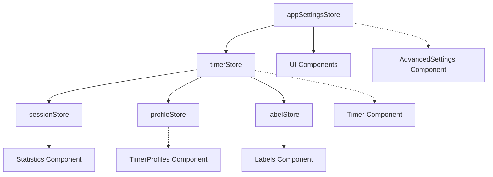

# Goodtime Web App - Developer Documentation

A comprehensive development guide for the Goodtime Pomodoro Timer web application. This document covers architecture, state management, component structure, and contribution guidelines.

## 🏗️ Architecture Overview

### Technology Stack Deep Dive

```
┌─────────────────────────────────────────────────────────────┐
│                    Frontend Layer                           │
├─────────────────────────────────────────────────────────────┤
│ React 18 + TypeScript + Vite + Tailwind CSS                │
│ • Component-based UI with hooks                            │
│ • Type-safe development with strict TypeScript             │
│ • Hot reload and optimized builds                          │
│ • Utility-first CSS with responsive design                 │
└─────────────────────────────────────────────────────────────┘
         ↓
┌─────────────────────────────────────────────────────────────┐
│                  State Management Layer                     │
├─────────────────────────────────────────────────────────────┤
│ Zustand Stores + Persist Middleware                        │
│ • timerStore: Core timer logic & state                     │
│ • sessionStore: Session tracking & history                 │
│ • labelStore: Label management with colors                 │
│ • profileStore: Timer profiles & presets                   │
│ • appSettingsStore: App configuration & preferences        │
└─────────────────────────────────────────────────────────────┘
         ↓
┌─────────────────────────────────────────────────────────────┐
│                   Persistence Layer                         │
├─────────────────────────────────────────────────────────────┤
│ Browser LocalStorage + PWA Service Worker                  │
│ • Automatic state persistence                              │
│ • Offline data availability                                │
│ • Settings and session data backup                         │
└─────────────────────────────────────────────────────────────┘
```

### Core Design Principles

1. **State-First Architecture**: All application state managed through Zustand stores
2. **Component Composition**: Reusable, focused components with clear responsibilities
3. **Type Safety**: Comprehensive TypeScript coverage with strict mode
4. **Performance Optimization**: Minimal re-renders, efficient state updates
5. **Progressive Enhancement**: Works offline, installable as PWA
6. **Mobile-First**: Responsive design with touch-friendly interactions

## 📁 Detailed Project Structure

```
webApp/
├── public/                          # Static assets & PWA files
│   ├── manifest.json               # PWA manifest configuration
│   ├── sw.js                       # Service worker for offline support
│   ├── icons/                      # PWA icons (various sizes)
│   └── favicon.ico                 # Browser favicon
│
├── src/
│   ├── components/                 # React UI components
│   │   ├── Timer.tsx              # Main timer interface (375 lines)
│   │   │   ├── Circular progress ring with animations
│   │   │   ├── Timer controls (play, pause, stop, skip, reset)
│   │   │   ├── +60 seconds quick extension feature
│   │   │   ├── Label selector dropdown integration
│   │   │   └── Profile switching interface
│   │   │
│   │   ├── Settings.tsx           # Basic timer settings (351 lines)
│   │   │   ├── Timer mode selection (countdown/stopwatch)
│   │   │   ├── Duration configuration with validation
│   │   │   ├── Break settings management
│   │   │   └── Quick access to advanced features
│   │   │
│   │   ├── AdvancedSettings.tsx   # Comprehensive settings (416 lines)
│   │   │   ├── Notifications & Sounds configuration
│   │   │   ├── Theme system (Light/Dark/Auto)
│   │   │   ├── Timer behavior customization
│   │   │   ├── Statistics & Goals configuration
│   │   │   ├── Privacy & Data controls
│   │   │   └── Settings backup/restore functionality
│   │   │
│   │   ├── Labels.tsx             # Label/tag management (325 lines)
│   │   │   ├── CRUD operations for labels
│   │   │   ├── 25-color palette system
│   │   │   ├── Archive/restore functionality
│   │   │   └── Usage statistics per label
│   │   │
│   │   ├── TimerProfiles.tsx      # Profile management (380 lines)
│   │   │   ├── Pre-built profile templates
│   │   │   ├── Custom profile creation/editing
│   │   │   ├── Profile duplication and validation
│   │   │   └── Quick profile switching
│   │   │
│   │   ├── SessionEditor.tsx      # Manual session editing (357 lines)
│   │   │   ├── Add/edit/delete session entries
│   │   │   ├── Flexible duration input (MM:SS, HH:MM:SS)
│   │   │   ├── Date/time picker integration
│   │   │   └── Session type and label assignment
│   │   │
│   │   └── Statistics.tsx         # Analytics & export (250 lines)
│   │       ├── Session statistics calculation
│   │       ├── Label-based productivity metrics
│   │       ├── JSON export functionality
│   │       └── Data visualization components
│   │
│   ├── stores/                    # Zustand state stores
│   │   ├── timerStore.ts          # Core timer state (180 lines)
│   │   │   ├── Timer state: isRunning, timeRemaining, currentType
│   │   │   ├── Timer actions: start, pause, stop, skip, reset, addTime
│   │   │   ├── Profile integration and duration management
│   │   │   └── Session completion and auto-progression logic
│   │   │
│   │   ├── sessionStore.ts        # Session tracking (120 lines)
│   │   │   ├── Session CRUD operations
│   │   │   ├── Statistics calculation helpers
│   │   │   ├── JSON export/import functionality
│   │   │   └── Data persistence and hydration
│   │   │
│   │   ├── labelStore.ts          # Label management (150 lines)
│   │   │   ├── Label CRUD with validation
│   │   │   ├── 25-color palette constants
│   │   │   ├── Archive/restore state management
│   │   │   └── Default labels initialization
│   │   │
│   │   ├── profileStore.ts        # Profile management (200 lines)
│   │   │   ├── Profile CRUD operations
│   │   │   ├── Pre-built profile templates
│   │   │   ├── Profile validation and defaults
│   │   │   └── Active profile state management
│   │   │
│   │   └── appSettingsStore.ts    # App configuration (110 lines)
│   │       ├── Theme and UI preferences
│   │       ├── Notification and sound settings
│   │       ├── Timer behavior configuration
│   │       ├── Privacy and data retention settings
│   │       └── Settings export/import functionality
│   │
│   ├── types/                     # TypeScript definitions
│   │   ├── index.ts              # Core type definitions
│   │   │   ├── TimerType enum (FOCUS, BREAK, LONG_BREAK)
│   │   │   ├── TimerProfile interface
│   │   │   ├── Session interface
│   │   │   ├── Label interface
│   │   │   └── AppSettings interface
│   │
│   ├── utils/                     # Utility functions
│   │   ├── timer.ts              # Timer calculations & notifications
│   │   │   ├── Duration formatting helpers
│   │   │   ├── Browser notification management
│   │   │   ├── Audio notification handling
│   │   │   └── Time calculation utilities
│   │   │
│   │   └── export.ts             # Data export functionality
│   │       ├── JSON export formatting
│   │       ├── CSV export helpers
│   │       ├── Statistics calculation
│   │       └── Data sanitization
│   │
│   ├── App.tsx                   # Main application (98 lines)
│   │   ├── Component orchestration
│   │   ├── Modal state management
│   │   ├── Document title updates
│   │   └── Favicon management
│   │
│   ├── main.tsx                  # Application entry point
│   │   ├── React 18 createRoot
│   │   ├── StrictMode wrapper
│   │   └── CSS imports
│   │
│   └── index.css                 # Global styles & Tailwind
│       ├── Tailwind directives
│       ├── Custom CSS variables
│       ├── Animation keyframes
│       └── Component-specific overrides
│
├── package.json                  # Dependencies & scripts
├── vite.config.ts               # Vite configuration
├── tailwind.config.js           # Tailwind customization
├── tsconfig.json                # TypeScript configuration
└── .gitignore                   # Git ignore rules
```

## 🔄 State Management Architecture

### Store Relationships & Data Flow



### Store Responsibilities

#### 1. **timerStore.ts** - Central Timer Logic
```typescript
interface TimerState {
  // Core timer state
  isRunning: boolean
  timeRemaining: number  // seconds
  currentType: TimerType
  sessionCount: number
  
  // Actions
  start: () => void
  pause: () => void  
  stop: () => void
  skip: () => void
  reset: () => void
  addTime: (seconds: number) => void
}
```

**Key Responsibilities:**
- Timer state management and interval handling
- Integration with profileStore for duration settings
- Session completion triggers and auto-progression
- Integration with labelStore for session labeling
- Automatic sessionStore updates on completion

#### 2. **sessionStore.ts** - Session Tracking & History
```typescript
interface SessionStore {
  sessions: Session[]
  addSession: (session: SessionData) => void
  updateSession: (id: string, updates: Partial<Session>) => void
  deleteSession: (id: string) => void
  clearSessions: () => void
  exportData: () => string
}
```

**Key Responsibilities:**
- Persistent session storage and retrieval
- Statistics calculation and aggregation
- JSON export functionality
- Session CRUD operations with validation

#### 3. **labelStore.ts** - Label/Tag Management
```typescript
interface LabelStore {
  labels: Label[]
  activeLabel: string
  addLabel: (name: string, colorIndex: number) => void
  updateLabel: (id: string, updates: Partial<Label>) => void
  archiveLabel: (id: string) => void
  restoreLabel: (id: string) => void
}
```

**Key Responsibilities:**
- Label CRUD with 25-color palette system
- Archive/restore functionality for organization
- Active label state for timer integration
- Default labels initialization and management

#### 4. **profileStore.ts** - Timer Profile Management
```typescript
interface ProfileStore {
  profiles: TimerProfile[]
  currentProfile: TimerProfile
  addProfile: (profile: TimerProfileData) => void
  updateProfile: (id: string, updates: Partial<TimerProfile>) => void
  deleteProfile: (id: string) => void
  setCurrentProfile: (id: string) => void
}
```

**Key Responsibilities:**
- Pre-built and custom profile management
- Profile validation and defaults
- Current profile state for timer integration
- Profile templates (Classic, Extended, Deep Work, etc.)

#### 5. **appSettingsStore.ts** - Application Configuration
```typescript
interface AppSettingsStore {
  settings: AppSettings
  updateSettings: (updates: Partial<AppSettings>) => void
  resetToDefaults: () => void
  exportSettings: () => string
  importSettings: (settingsJson: string) => boolean
}
```

**Key Responsibilities:**
- Theme and UI preferences
- Notification and audio settings
- Timer behavior configuration
- Privacy and data retention settings
- Settings backup/restore functionality

## 🧩 Component Architecture

### Component Hierarchy & Communication

```
App.tsx (Root Container)
├── SettingsButton (Fixed position)
├── Timer (Main Interface)
│   ├── Circular progress visualization
│   ├── Timer controls (start, pause, stop, skip, reset)
│   ├── +60s quick extension
│   ├── Label selector dropdown
│   └── Profile switching interface
├── Settings Modal
│   ├── Basic timer configuration
│   ├── Quick access buttons to:
│   │   ├── Labels Management
│   │   ├── Timer Profiles
│   │   └── Advanced Settings
├── Statistics Modal
│   ├── Session statistics & analytics
│   ├── Data export functionality
│   └── Access to Session Editor
├── Labels Management Modal
│   ├── Label CRUD interface
│   ├── Color palette selection
│   └── Archive/restore controls
├── Timer Profiles Modal
│   ├── Profile templates gallery
│   ├── Custom profile creation
│   └── Profile management tools
├── Session Editor Modal
│   ├── Manual session entry form
│   ├── Session history table
│   └── Bulk data management
└── Advanced Settings Modal
    ├── Comprehensive configuration panels
    ├── Theme and appearance settings
    ├── Notification preferences
    ├── Privacy controls
    └── Settings backup/restore
```

### Component Communication Patterns

1. **Store → Component**: Direct subscription via Zustand hooks
2. **Component → Store**: Action dispatch through store methods
3. **Component → Component**: Minimal - mostly through shared stores
4. **Parent → Child**: Props for UI state (modals, callbacks)

### Key Design Patterns Used

#### 1. **Custom Hooks for Complex Logic**
```typescript
// Example: useTimer hook (potential extraction)
const useTimer = () => {
  const { isRunning, timeRemaining, start, pause } = useTimerStore()
  const { addSession } = useSessionStore()
  
  // Complex timer logic here
  return { /* simplified interface */ }
}
```

#### 2. **Compound Components for Settings**
```typescript
// ToggleSwitch and SliderInput reusable components
const ToggleSwitch = ({ enabled, onChange, label, description }) => { /* */ }
const SliderInput = ({ value, onChange, min, max, label, unit }) => { /* */ }
```

#### 3. **State Normalization**
- IDs for all entities (sessions, labels, profiles)
- Consistent data shapes across stores
- Validation at store boundaries

## 🔧 Development Workflow

### Setting Up Development Environment

```bash
# 1. Prerequisites
node --version  # Should be 18+
npm --version   # Should be 9+

# 2. Clone and setup
git clone <repo-url>
cd goodtime-minimalist-pomodoro-app
git checkout browser-app-v1
cd webApp

# 3. Install dependencies
npm install

# 4. Start development server
npm run dev

# 5. Open development tools
# Browser DevTools → Application → Local Storage
# React DevTools browser extension
# Zustand DevTools (if installed)
```

### Development Scripts Explained

```bash
# Development
npm run dev          # Vite dev server with hot reload (port 5173)
npm run dev --host   # Expose dev server on network (mobile testing)

# Code Quality
npm run lint         # ESLint with TypeScript rules
npm run lint --fix   # Auto-fix linting issues
npm run type-check   # TypeScript compilation check

# Building
npm run build        # Production build to dist/
npm run preview      # Preview production build locally

# Advanced Development
npm run build -- --mode development  # Development build
npm run dev -- --port 3000          # Custom port
```

### Code Style & Standards

#### TypeScript Configuration
- **Strict mode enabled**: All type checking rules enforced
- **No implicit any**: All variables must be typed
- **Unused imports/variables**: Treated as errors
- **React hooks rules**: ESLint plugin enforced

#### Component Guidelines
```typescript
// ✅ Good: Functional component with proper typing
interface TimerProps {
  onComplete: () => void
  initialTime?: number
}

export const Timer: React.FC<TimerProps> = ({ 
  onComplete, 
  initialTime = 1500 
}) => {
  // Component implementation
}

// ❌ Avoid: Untyped components
export const Timer = ({ onComplete, initialTime }) => {
  // Missing types
}
```

#### Store Pattern Guidelines
```typescript
// ✅ Good: Proper Zustand store structure
export const useExampleStore = create<ExampleStore>()(
  persist(
    (set, get) => ({
      // State
      items: [],
      
      // Actions with validation
      addItem: (item) => {
        if (!item.name.trim()) return
        set((state) => ({
          items: [...state.items, { ...item, id: crypto.randomUUID() }]
        }))
      },
      
      // Computed values
      getItemCount: () => get().items.length
    }),
    {
      name: 'example-store',
      partialize: (state) => ({ items: state.items }) // Only persist what's needed
    }
  )
)
```

## 🧪 Testing Strategy

### Current Testing Approach
- **Manual Testing**: Comprehensive manual testing across features
- **Browser Testing**: Chrome, Firefox, Safari, Edge compatibility
- **Device Testing**: Desktop, tablet, mobile responsive design
- **PWA Testing**: Installation, offline functionality, notifications

### Recommended Testing Additions

#### 1. **Unit Tests with Vitest**
```bash
npm install -D vitest @testing-library/react @testing-library/jest-dom
```

```typescript
// Example: stores/__tests__/timerStore.test.ts
import { describe, it, expect, beforeEach } from 'vitest'
import { useTimerStore } from '../timerStore'

describe('timerStore', () => {
  beforeEach(() => {
    useTimerStore.getState().reset()
  })

  it('should start timer correctly', () => {
    const { start, isRunning } = useTimerStore.getState()
    start()
    expect(isRunning).toBe(true)
  })
})
```

#### 2. **Component Tests**
```typescript
// Example: components/__tests__/Timer.test.tsx
import { render, screen, fireEvent } from '@testing-library/react'
import { Timer } from '../Timer'

describe('Timer Component', () => {
  it('should display timer controls', () => {
    render(<Timer onShowStats={() => {}} />)
    expect(screen.getByRole('button', { name: /start/i })).toBeInTheDocument()
  })
})
```

#### 3. **E2E Tests with Playwright**
```bash
npm install -D @playwright/test
```

```typescript
// Example: e2e/timer-flow.spec.ts
import { test, expect } from '@playwright/test'

test('complete pomodoro session', async ({ page }) => {
  await page.goto('/')
  await page.click('[data-testid="start-button"]')
  // Test complete user flow
})
```

## 🔍 Debugging & Development Tools

### Browser DevTools Usage

#### 1. **Application Tab**
- **Local Storage**: View persisted store data
  - `goodtime-timer-store`: Timer state and profiles
  - `goodtime-session-store`: Session history
  - `goodtime-label-store`: Labels and colors
  - `goodtime-app-settings-store`: App preferences

#### 2. **Console Debugging**
```javascript
// Access stores directly in console
window.__TIMER_STORE__ = useTimerStore.getState()
window.__SESSION_STORE__ = useSessionStore.getState()

// Debug store state
console.log(window.__TIMER_STORE__.currentType)
console.log(window.__SESSION_STORE__.sessions)
```

#### 3. **Network Tab**
- Service Worker registration and updates
- Static asset loading and caching
- No network requests for core functionality (offline-first)

### Common Development Issues & Solutions

#### 1. **State Not Persisting**
```typescript
// Check persist configuration
const useExampleStore = create<ExampleStore>()(
  persist(
    // ... store implementation
    {
      name: 'store-name',
      // Ensure partialize includes required state
      partialize: (state) => ({ 
        importantData: state.importantData 
      })
    }
  )
)
```

#### 2. **Component Re-rendering Issues**
```typescript
// ✅ Good: Selective store subscription
const isRunning = useTimerStore((state) => state.isRunning)

// ❌ Avoid: Full store subscription
const store = useTimerStore() // Subscribes to all changes
```

#### 3. **Timer Accuracy Issues**
```typescript
// Use precise timing with drift correction
useEffect(() => {
  if (!isRunning) return
  
  const startTime = Date.now()
  const expectedTime = timeRemaining * 1000
  
  const interval = setInterval(() => {
    const elapsed = Date.now() - startTime
    const remaining = Math.max(0, expectedTime - elapsed)
    // Update with corrected time
  }, 100)
  
  return () => clearInterval(interval)
}, [isRunning])
```

## 🚀 Performance Optimization

### Current Optimizations

#### 1. **Bundle Optimization**
- **Vite Tree Shaking**: Eliminates unused code
- **Code Splitting**: Dynamic imports for large components
- **Asset Optimization**: Image compression and format selection

#### 2. **Runtime Performance**
- **Zustand**: Minimal re-renders with selective subscriptions
- **React 18 Features**: Concurrent rendering and automatic batching
- **Efficient Animations**: CSS transforms over layout changes

#### 3. **Memory Management**
- **Cleanup on Unmount**: Timer intervals and event listeners
- **Bounded Storage**: Session history limits and cleanup
- **Efficient Data Structures**: Normalized state shapes

### Performance Monitoring

```typescript
// Add performance markers for debugging
const markStart = (name: string) => performance.mark(`${name}-start`)
const markEnd = (name: string) => {
  performance.mark(`${name}-end`)
  performance.measure(name, `${name}-start`, `${name}-end`)
}

// Usage in components
useEffect(() => {
  markStart('timer-render')
  return () => markEnd('timer-render')
}, [])
```

## 🔄 Data Migration & Versioning

### Store Version Management

```typescript
// Example migration strategy
const STORE_VERSION = 2

const migrateStore = (persistedState: any, version: number) => {
  if (version < 2) {
    // Migrate from v1 to v2
    return {
      ...persistedState,
      newProperty: defaultValue,
      version: 2
    }
  }
  return persistedState
}

export const useExampleStore = create<ExampleStore>()(
  persist(
    // ... store implementation
    {
      name: 'store-name',
      version: STORE_VERSION,
      migrate: migrateStore
    }
  )
)
```

### Data Backup & Recovery

#### Export Format Versioning
```typescript
interface ExportData {
  version: string        // App version
  exportDate: string    // ISO timestamp
  formatVersion: number // Export format version
  data: {
    sessions: Session[]
    labels: Label[]
    profiles: TimerProfile[]
    settings: AppSettings
  }
}
```

## 🛡️ Security Considerations

### Client-Side Security

#### 1. **Data Sanitization**
```typescript
// Sanitize user input for labels
const sanitizeLabelName = (name: string): string => {
  return name
    .trim()
    .replace(/[<>]/g, '') // Remove potential HTML
    .substring(0, 50)     // Limit length
}
```

#### 2. **Safe Data Parsing**
```typescript
// Safe JSON parsing with validation
const safeParseSettings = (json: string): AppSettings | null => {
  try {
    const parsed = JSON.parse(json)
    if (!isValidSettingsObject(parsed)) {
      return null
    }
    return parsed
  } catch {
    return null
  }
}
```

#### 3. **Content Security Policy**
```html
<!-- Add to index.html -->
<meta http-equiv="Content-Security-Policy" 
      content="default-src 'self'; script-src 'self' 'unsafe-inline'">
```

## 📱 PWA Development

### Service Worker Management

```javascript
// public/sw.js - Key concepts
self.addEventListener('install', (event) => {
  // Cache static assets
  event.waitUntil(
    caches.open('goodtime-v1').then((cache) => {
      return cache.addAll([
        '/',
        '/static/js/bundle.js',
        '/static/css/main.css'
      ])
    })
  )
})

self.addEventListener('fetch', (event) => {
  // Cache-first strategy for static assets
  event.respondWith(
    caches.match(event.request).then((response) => {
      return response || fetch(event.request)
    })
  )
})
```

### Manifest Configuration

```json
{
  "name": "Goodtime Pomodoro Timer",
  "short_name": "Goodtime",
  "description": "Minimalist Pomodoro productivity timer",
  "start_url": "/",
  "display": "standalone",
  "theme_color": "#ef4444",
  "background_color": "#ffffff",
  "categories": ["productivity", "utilities"],
  "icons": [
    {
      "src": "/icons/icon-192.png",
      "sizes": "192x192",
      "type": "image/png"
    }
  ]
}
```

## 🤝 Contribution Guidelines

### Code Contribution Process

1. **Fork & Branch**
   ```bash
   git checkout browser-app-v1
   git pull origin browser-app-v1
   git checkout -b feature/new-feature-name
   ```

2. **Development**
   - Follow existing code patterns and TypeScript conventions
   - Add proper type definitions for new features
   - Test across different browsers and screen sizes
   - Ensure PWA functionality remains intact

3. **Commit Standards**
   ```bash
   # Use conventional commits
   git commit -m "feat: add new timer profile template"
   git commit -m "fix: resolve timer accuracy issue"
   git commit -m "docs: update component documentation"
   ```

4. **Pull Request**
   - Include description of changes and reasoning
   - Add screenshots for UI changes
   - Test PWA installation and offline functionality
   - Ensure no TypeScript errors or lint warnings

### Adding New Features

#### 1. **New Store** (for major features)
```typescript
// 1. Create store file in src/stores/
export interface NewFeatureStore {
  data: NewFeatureData[]
  addItem: (item: NewFeatureData) => void
  // ... other methods
}

// 2. Add to main store imports
// 3. Integrate with existing stores if needed
// 4. Add persistence configuration
```

#### 2. **New Component** (for UI features)
```typescript
// 1. Create component file in src/components/
// 2. Follow existing patterns for modal components
// 3. Add proper TypeScript interfaces
// 4. Integrate with relevant stores
// 5. Add to App.tsx if needed
```

#### 3. **New Utility** (for shared logic)
```typescript
// 1. Create utility file in src/utils/
// 2. Export pure functions with proper typing
// 3. Add comprehensive JSDoc documentation
// 4. Import and use in relevant components
```

### Code Review Checklist

- [ ] TypeScript compilation passes without errors
- [ ] ESLint passes without warnings
- [ ] Component follows existing patterns
- [ ] Store integration is proper and efficient
- [ ] PWA functionality is not broken
- [ ] Mobile responsiveness is maintained
- [ ] Browser compatibility is preserved
- [ ] Performance impact is minimal
- [ ] Security considerations are addressed

## 📚 Additional Resources

### External Documentation
- [React 18 Documentation](https://react.dev/)
- [TypeScript Handbook](https://www.typescriptlang.org/docs/)
- [Zustand Documentation](https://zustand-demo.pmnd.rs/)
- [Vite Documentation](https://vitejs.dev/guide/)
- [Tailwind CSS Documentation](https://tailwindcss.com/docs)
- [PWA Documentation](https://web.dev/progressive-web-apps/)

### Internal References
- `README.md` - User documentation and setup guide
- `CLAUDE.md` - Feature requirements from Android version
- `package.json` - Dependencies and available scripts
- `vite.config.ts` - Build configuration and PWA setup

---

**Happy coding! 🍅** This documentation should provide everything needed to understand, develop, and contribute to the Goodtime web application.